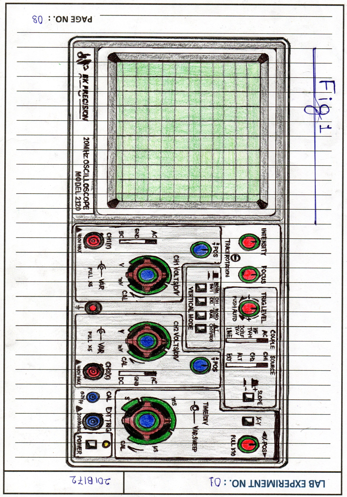

## ⚡ Electronics Lab Experience — Bench-Level Test Equipment

As part of my Electrical/Electronics coursework, I completed a series of hands-on lab
experiments focused on analog electronics, gaining practical proficiency with standard
bench-level test equipment.

**Equipment used:**
- DC Power Supplies
- Oscilloscopes
- Multimeters
- Function Generators

**Topics covered:**
- Diode characteristics and rectifier circuits
- Transistor biasing and switching behavior
- Amplifier design and gain/frequency response measurement
- Signal measurement, waveform analysis, and circuit debugging using an oscilloscope

Each experiment involved building circuits on a breadboard, powering them with a DC supply,
measuring voltage/current/resistance with a multimeter, and analyzing waveforms and signal
behavior on an oscilloscope.

### 📷 Pictures

|  | 
